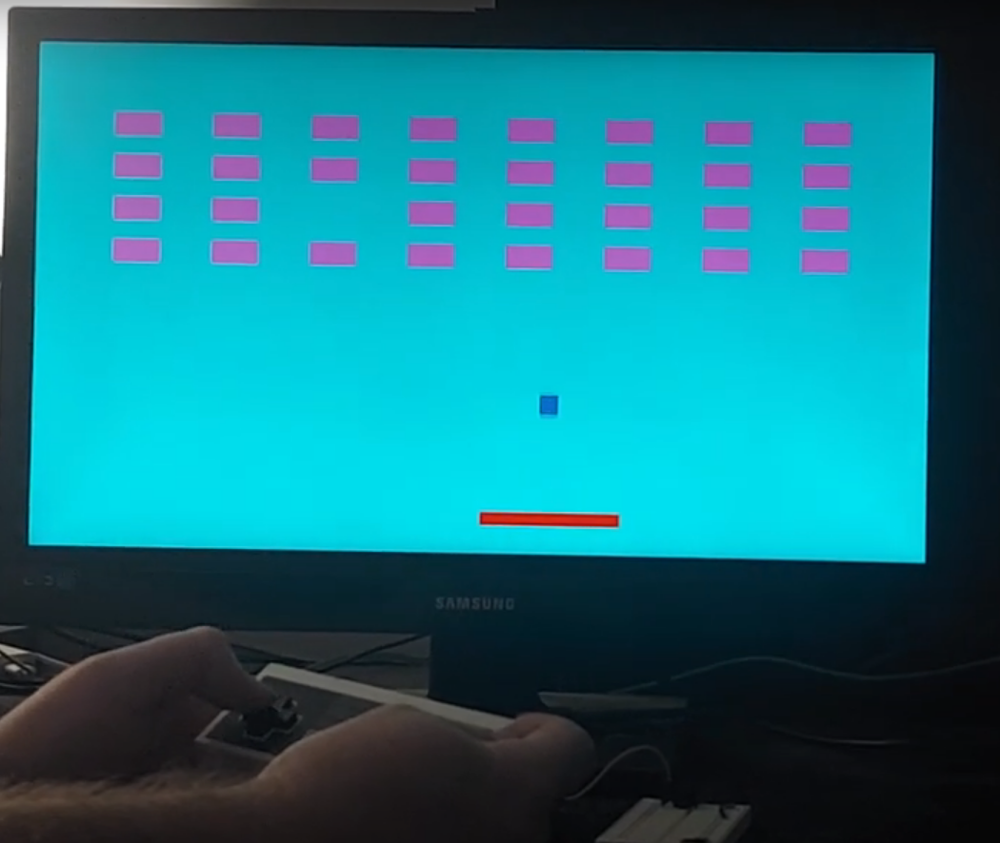

Dale Andreoli

and17081@byui.edu
# FPGA Game Project

[Video Demonstration](https://youtu.be/BgsAh8YejHQ)

# Contents
## [Purpose](Report/Purpose.md)
## [Methods and Procedure](Report/Methods.md)
## [Results](Report/Results.md)
* [Video Output](Report/Results-VideoOutput.md)
* [Renderer](Report/Results-Renderer.md)
* [Controller](Report/Results-Controller.md)
* [Paddle](Report/Results-Paddle.md)
* [Ball](Report/Results-Ball.md)
* [Collisions](Report/Results-Collisions.md)
* [Sound](Report/Results-Sound.md)
* [Bricks](Report/Results-Bricks.md)
* [Game State](Report/Results-GameState.md)
## [Conclusions](Report/Conclusions.md)
## [References](Report/References.md)