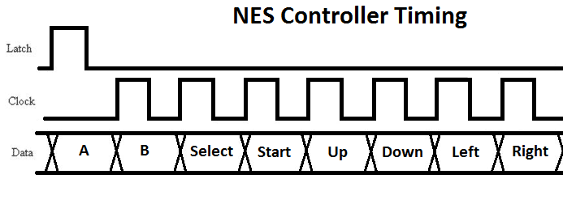

[Back to Welcome Page](../README.md)

# Results

## Controller

The NES controller sends all of its button values through a single data pin, which can be read with the help of a clock signal and latch signal that are sent into the controller. The following diagram was used to hook up each pin to the FPGA (pinoutguide).

The controller sends button data one data per clock pulse, with a latch signal use to sync to the A button data signal. This process can be seen in the following timing diagram (bertiusgames). 

To implement this timing for the controller, Latch is set high which makes the controller send the A button data. Then Latch is set low, and the controller is sent 7 pulses to its Clock input. This will cause it to return the next 7 button values through its Data output. A common way I found similar projects used to implement this is with a state machine by using a case statement for each step of communicating with the controller.

[Next Page](Results-Paddle.md)

[Back to Welcome Page](../README.md)